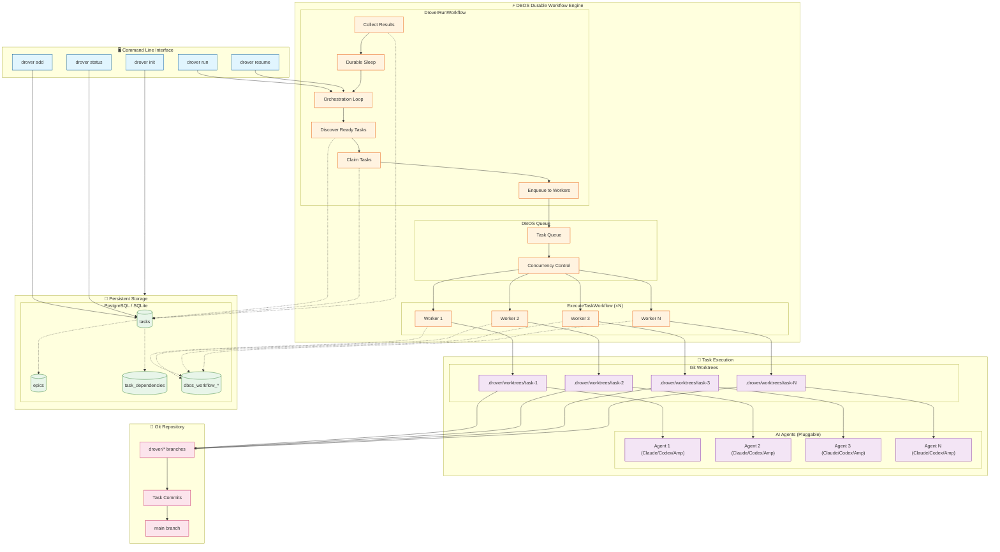
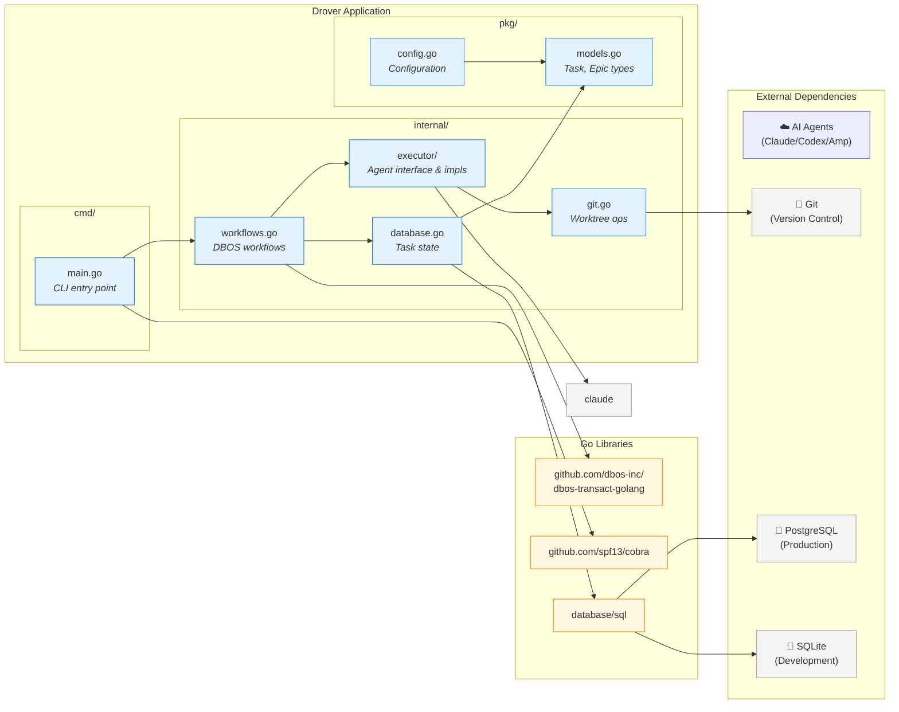

# Drover Architecture Diagram

**Navigation:**
- [Documentation Index](../docs/index.md) - Central documentation hub
- [Durable Workflows Spec](../spec/durable-workflows.md) - Workflow engine specification
- [Design Overview](./DESIGN.md) - Comprehensive design document
- [State Machine](./state-machine.md) - Task state transitions
- [Sequence Diagrams](./sequence.md) - Runtime flow

---



## Component Organization



## Directory Structure

```
drover/
├── cmd/
│   └── drover/
│       ├── main.go          # CLI entry point
│       └── commands.go      # Command implementations
├── internal/
│   ├── config/              # Configuration loading
│   ├── db/                  # Database operations
│   ├── executor/            # Agent interface (Claude/Codex/Amp)
│   ├── workflow/            # DBOS workflow definitions
│   └── git/                 # Git worktree management
├── pkg/
│   └── types/               # Shared types (Task, Epic, etc.)
├── design/
│   ├── DESIGN.md            # This document
│   ├── sequence.md          # Runtime flow diagrams
│   └── state-machine.md     # Task state transitions
├── go.mod
├── go.sum
└── README.md
```

## Data Flow

```
User Input → CLI Command → DBOS Workflow → Database Query
                                        ↓
                                  DBOS Queue
                                        ↓
                            ┌───────────┼───────────┐
                            ↓           ↓           ↓
                        Worker 1    Worker 2    Worker N
                            ↓           ↓           ↓
                      Worktree 1  Worktree 2  Worktree N
                            ↓           ↓           ↓
                      Agent (Claude/Codex/Amp)  ...
                            ↓           ↓           ↓
                      Git Commit   Git Commit   Git Commit
                            └───────────┼───────────┘
                                        ↓
                                  Merge to Main
                                        ↓
                                  Update Database
                                        ↓
                            Unblock Dependent Tasks
```
