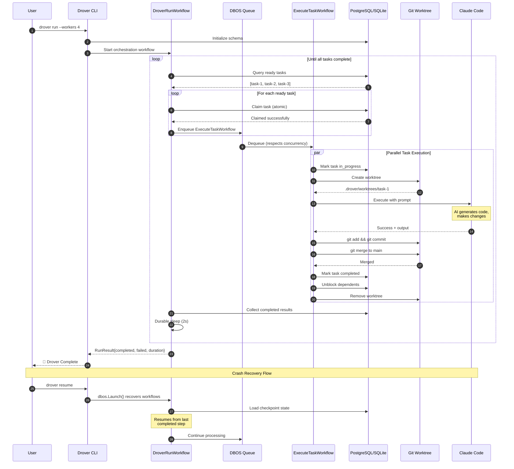
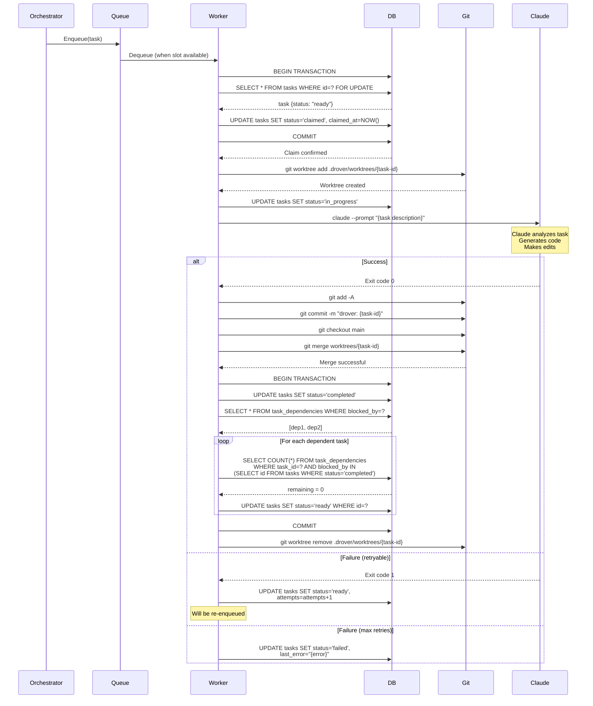
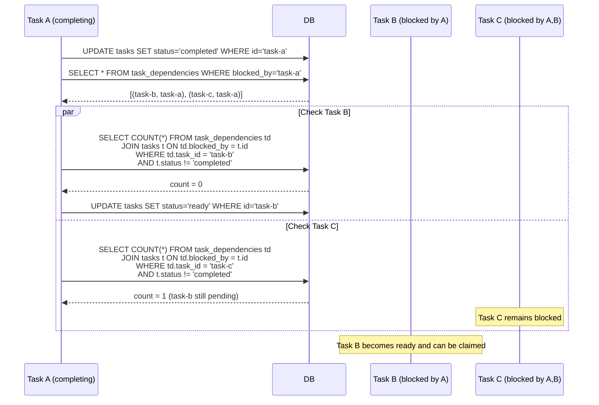
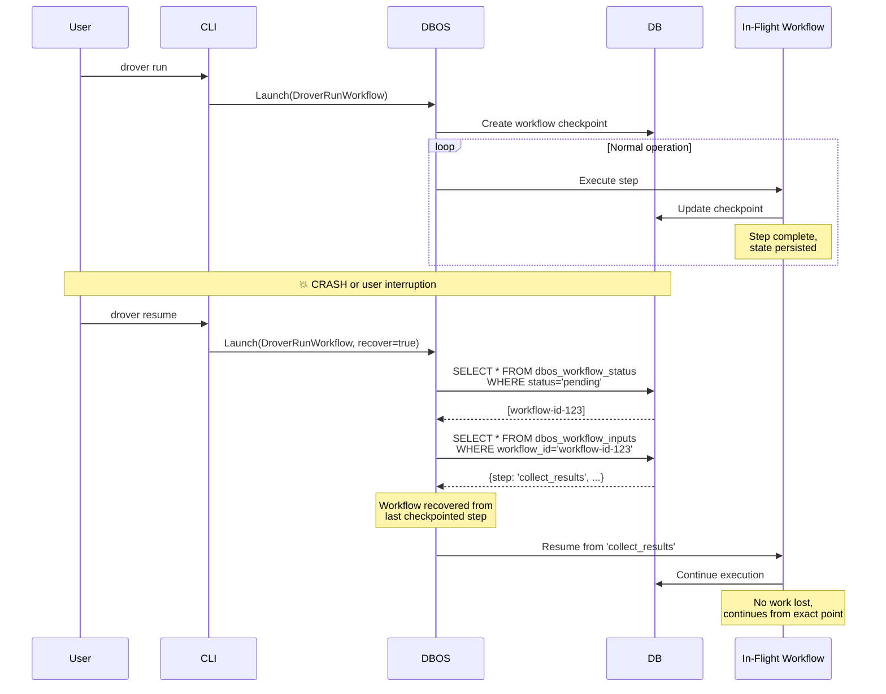
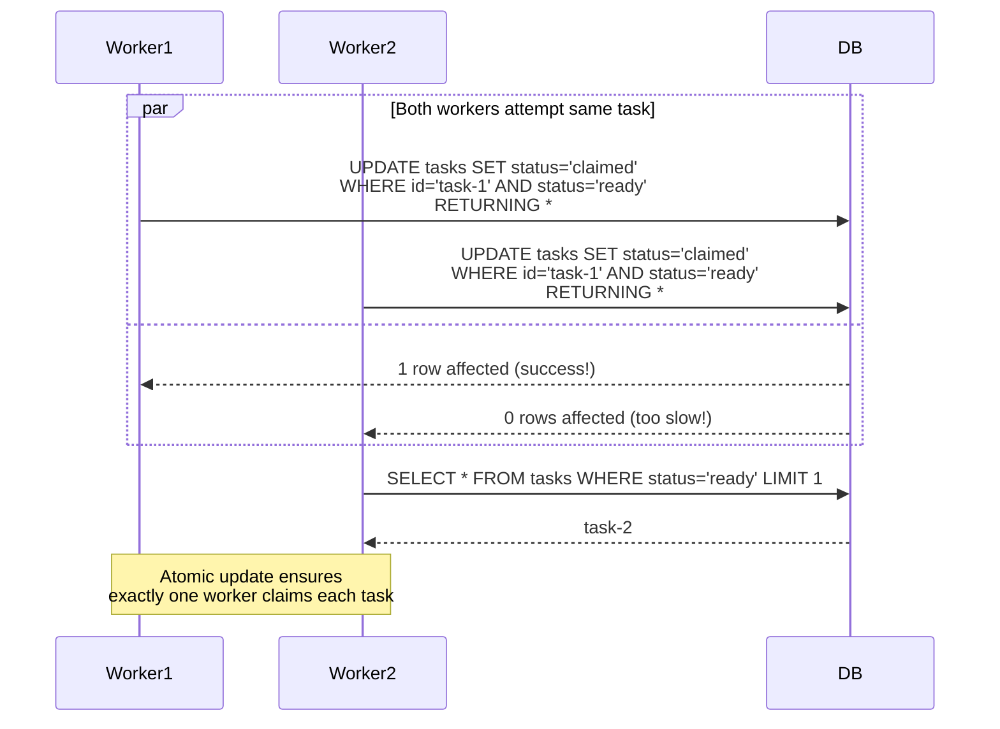

# Drover Runtime Flow

## Main Execution Sequence

```mermaid
sequenceDiagram
    autonumber
    participant User
    participant CLI as Drover CLI
    participant Main as DroverRunWorkflow
    participant Queue as DBOS Queue
    participant Worker as ExecuteTaskWorkflow
    participant DB as PostgreSQL/SQLite
    participant Git as Git Worktree
    participant Claude as Claude Code

    User->>CLI: drover run --workers 4
    CLI->>DB: Initialize schema
    CLI->>Main: Start orchestration workflow

    loop Until all tasks complete
        Main->>DB: Query ready tasks
        DB-->>Main: [task-1, task-2, task-3]

        loop For each ready task
            Main->>DB: Claim task (atomic)
            DB-->>Main: Claimed successfully
            Main->>Queue: Enqueue ExecuteTaskWorkflow
        end

        Queue->>Worker: Dequeue (respects concurrency)

        par Parallel Task Execution
            Worker->>DB: Mark task in_progress
            Worker->>Git: Create worktree
            Git-->>Worker: .drover/worktrees/task-1
            Worker->>Claude: Execute with prompt

            Note over Claude: AI generates code,<br/>makes changes

            Claude-->>Worker: Success + output
            Worker->>Git: git add && git commit
            Worker->>Git: git merge to main
            Git-->>Worker: Merged
            Worker->>DB: Mark task completed
            Worker->>DB: Unblock dependents
            Worker->>Git: Remove worktree
        end

        Main->>DB: Collect completed results
        Main->>Main: Durable sleep (2s)
    end

    Main-->>CLI: RunResult{completed, failed, duration}
    CLI-->>User: 🐂 Drover Complete

    Note over User,Claude: Crash Recovery Flow

    User->>CLI: drover resume
    CLI->>Main: dbos.Launch() recovers workflows
    Main->>DB: Load checkpoint state
    Note over Main: Resumes from last<br/>completed step
    Main->>Queue: Continue processing
```

## Task Lifecycle Detail

```mermaid
sequenceDiagram
    participant Orchestrator
    participant Queue
    participant Worker
    participant DB
    participant Git
    participant Claude

    Orchestrator->>Queue: Enqueue(task)
    Queue->>Worker: Dequeue (when slot available)

    Worker->>DB: BEGIN TRANSACTION
    Worker->>DB: SELECT * FROM tasks WHERE id=? FOR UPDATE
    DB-->>Worker: task {status: "ready"}
    Worker->>DB: UPDATE tasks SET status='claimed', claimed_at=NOW()
    Worker->>DB: COMMIT
    DB-->>Worker: Claim confirmed

    Worker->>Git: git worktree add .drover/worktrees/{task-id}
    Git-->>Worker: Worktree created

    Worker->>DB: UPDATE tasks SET status='in_progress'

    Worker->>Claude: claude --prompt "{task description}"
    Note over Claude: Claude analyzes task<br/>Generates code<br/>Makes edits

    alt Success
        Claude-->>Worker: Exit code 0
        Worker->>Git: git add -A
        Worker->>Git: git commit -m "drover: {task-id}"
        Worker->>Git: git checkout main
        Worker->>Git: git merge worktrees/{task-id}
        Git-->>Worker: Merge successful

        Worker->>DB: BEGIN TRANSACTION
        Worker->>DB: UPDATE tasks SET status='completed'
        Worker->>DB: SELECT * FROM task_dependencies WHERE blocked_by=?
        DB-->>Worker: [dep1, dep2]

        loop For each dependent task
            Worker->>DB: SELECT COUNT(*) FROM task_dependencies<br/>WHERE task_id=? AND blocked_by IN<br/>(SELECT id FROM tasks WHERE status='completed')
            DB-->>Worker: remaining = 0
            Worker->>DB: UPDATE tasks SET status='ready' WHERE id=?
        end
        Worker->>DB: COMMIT

        Worker->>Git: git worktree remove .drover/worktrees/{task-id}
    else Failure (retryable)
        Claude-->>Worker: Exit code 1
        Worker->>DB: UPDATE tasks SET status='ready',<br/>attempts=attempts+1
        Note over Worker: Will be re-enqueued
    else Failure (max retries)
        Worker->>DB: UPDATE tasks SET status='failed',<br/>last_error="{error}"
    end
```

## Dependency Resolution Flow

```mermaid
sequenceDiagram
    participant TaskA as Task A (completing)
    participant DB
    participant TaskB as Task B (blocked by A)
    participant TaskC as Task C (blocked by A,B)

    TaskA->>DB: UPDATE tasks SET status='completed' WHERE id='task-a'
    TaskA->>DB: SELECT * FROM task_dependencies WHERE blocked_by='task-a'
    DB-->>TaskA: [(task-b, task-a), (task-c, task-a)]

    par Check Task B
        TaskA->>DB: SELECT COUNT(*) FROM task_dependencies td<br/>JOIN tasks t ON td.blocked_by = t.id<br/>WHERE td.task_id = 'task-b'<br/>AND t.status != 'completed'
        DB-->>TaskA: count = 0
        TaskA->>DB: UPDATE tasks SET status='ready' WHERE id='task-b'
    and Check Task C
        TaskA->>DB: SELECT COUNT(*) FROM task_dependencies td<br/>JOIN tasks t ON td.blocked_by = t.id<br/>WHERE td.task_id = 'task-c'<br/>AND t.status != 'completed'
        DB-->>TaskA: count = 1 (task-b still pending)
        Note over TaskC: Task C remains blocked
    end

    Note over TaskB: Task B becomes ready and can be claimed
```

## Crash Recovery Flow

```mermaid
sequenceDiagram
    participant User
    participant CLI
    participant DBOS
    participant DB
    participant Workflow as In-Flight Workflow

    User->>CLI: drover run
    CLI->>DBOS: Launch(DroverRunWorkflow)
    DBOS->>DB: Create workflow checkpoint

    loop Normal operation
        DBOS->>Workflow: Execute step
        Workflow->>DB: Update checkpoint
        Note over Workflow: Step complete,<br/>state persisted
    end

    Note over User,DB: 💥 CRASH or user interruption

    User->>CLI: drover resume
    CLI->>DBOS: Launch(DroverRunWorkflow, recover=true)

    DBOS->>DB: SELECT * FROM dbos_workflow_status<br/>WHERE status='pending'
    DB-->>DBOS: [workflow-id-123]

    DBOS->>DB: SELECT * FROM dbos_workflow_inputs<br/>WHERE workflow_id='workflow-id-123'
    DB-->>DBOS: {step: 'collect_results', ...}

    Note over DBOS: Workflow recovered from<br/>last checkpointed step

    DBOS->>Workflow: Resume from 'collect_results'
    Workflow->>DB: Continue execution

    Note over Workflow: No work lost,<br/>continues from exact point
```

## Concurrent Claiming Race Condition

```mermaid
sequenceDiagram
    participant Worker1
    participant Worker2
    participant DB

    par Both workers attempt same task
        Worker1->>DB: UPDATE tasks SET status='claimed'<br/>WHERE id='task-1' AND status='ready'<br/>RETURNING *
        Worker2->>DB: UPDATE tasks SET status='claimed'<br/>WHERE id='task-1' AND status='ready'<br/>RETURNING *
    and
        DB-->>Worker1: 1 row affected (success!)
        DB-->>Worker2: 0 rows affected (too slow!)
    end

    Worker2->>DB: SELECT * FROM tasks WHERE status='ready' LIMIT 1
    DB-->>Worker2: task-2

    Note over Worker1,Worker2: Atomic update ensures<br/>exactly one worker claims each task
```
