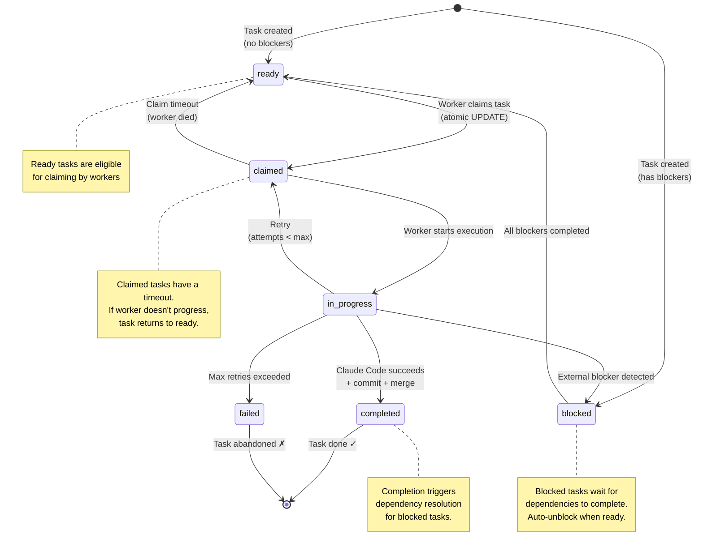

# Task State Machine

## State Transitions



## State Descriptions

| State | Description | Next States |
|-------|-------------|-------------|
| **ready** | Task is ready to be claimed by a worker | claimed |
| **claimed** | Worker has claimed the task, execution starting | in_progress, ready (timeout) |
| **in_progress** | Worker is actively executing via Claude Code | completed, failed, blocked, claimed (retry) |
| **blocked** | Task has unmet dependencies | ready |
| **completed** | Task finished successfully | [*] (terminal) |
| **failed** | Task failed after max retries | [*] (terminal) |

## Transition Triggers

### ready → claimed
- **Trigger**: Worker successfully executes atomic `UPDATE` on task
- **Condition**: `status = 'ready'`
- **SQL**: `UPDATE tasks SET status='claimed', claimed_at=NOW() WHERE id=? AND status='ready'`
- **Guard**: Only one worker can claim (row count = 1)

### claimed → in_progress
- **Trigger**: Worker creates git worktree and starts Claude Code
- **Condition**: Claim successful, worker starting execution
- **SQL**: `UPDATE tasks SET status='in_progress' WHERE id=?`

### claimed → ready (timeout)
- **Trigger**: Claim timeout expires (worker died)
- **Condition**: `claimed_at < NOW() - timeout`
- **SQL**: `UPDATE tasks SET status='ready', claimed_at=NULL WHERE claimed_at < ?`

### in_progress → completed
- **Trigger**: Claude Code exits successfully
- **Condition**: Exit code 0, changes committed and merged
- **SQL**: `UPDATE tasks SET status='completed' WHERE id=?`
- **Side effect**: Unblock dependent tasks

### in_progress → failed
- **Trigger**: Max retry attempts exceeded
- **Condition**: `attempts >= max_attempts`
- **SQL**: `UPDATE tasks SET status='failed', last_error=? WHERE id=?`

### in_progress → blocked
- **Trigger**: External blocker detected during execution
- **Condition**: Error indicates dependency on other task
- **SQL**: `UPDATE tasks SET status='blocked' WHERE id=?`
- **Side effect**: Create blocker task if auto-unblock enabled

### in_progress → claimed (retry)
- **Trigger**: Recoverable error
- **Condition**: `attempts < max_attempts`
- **SQL**: `UPDATE tasks SET status='claimed', attempts=attempts+1 WHERE id=?`

### blocked → ready
- **Trigger**: All blocking tasks completed
- **Condition**: `COUNT(blocked_by WHERE status='completed') = COUNT(blocked_by)`
- **SQL**: `UPDATE tasks SET status='ready' WHERE id=? AND (SELECT COUNT(*) ...) = 0`

## State Transitions Matrix

| From \ To | ready | claimed | in_progress | blocked | completed | failed |
|-----------|-------|---------|-------------|---------|-----------|--------|
| [*] | ✅ | | | ✅ | | |
| ready | | ✅ | | | | |
| claimed | ✅ | | ✅ | | | |
| in_progress | | ✅ | | ✅ | ✅ | ✅ |
| blocked | ✅ | | | | | |
| completed | | | | | | |
| failed | | | | | | |

## Timeout Handling

### Claim Timeout
```sql
-- Return stale claims to ready pool
UPDATE tasks
SET status = 'ready',
    claimed_at = NULL,
    attempts = attempts + 1
WHERE status = 'claimed'
  AND claimed_at < datetime('now', '-10 minutes');
```

### Progress Timeout
```sql
-- Detect stuck in_progress tasks
SELECT id, title, claimed_at
FROM tasks
WHERE status = 'in_progress'
  AND claimed_at < datetime('now', '-1 hour');
```

## Database Constraints

```sql
-- Ensure valid state transitions
CREATE TRIGGER validate_task_status
BEFORE UPDATE ON tasks
BEGIN
    SELECT CASE
        WHEN NEW.status NOT IN ('ready', 'claimed', 'in_progress', 'blocked', 'completed', 'failed') THEN
            RAISE(ABORT, 'Invalid task status')
        WHEN OLD.status = 'completed' AND NEW.status != 'completed' THEN
            RAISE(ABORT, 'Cannot change status of completed task')
        WHEN OLD.status = 'failed' AND NEW.status != 'failed' THEN
            RAISE(ABORT, 'Cannot change status of failed task')
    END;
END;

-- Auto-set updated_at
CREATE TRIGGER update_timestamp
BEFORE UPDATE ON tasks
BEGIN
    NEW.updated_at = strftime('%s', 'now');
END;
```

## Example Flow

```
Task created (no dependencies)
    ↓
status = 'ready'
    ↓
Worker 1 claims task
    ↓
status = 'claimed', claimed_at = NOW()
    ↓
Worker 1 creates worktree, starts Claude
    ↓
status = 'in_progress'
    ↓
Claude completes successfully
    ↓
Worker 1 commits changes, merges to main
    ↓
status = 'completed'
    ↓
Check for dependent tasks
    ↓
For each task blocked by this one:
    if no remaining blockers:
        status = 'ready'
```
